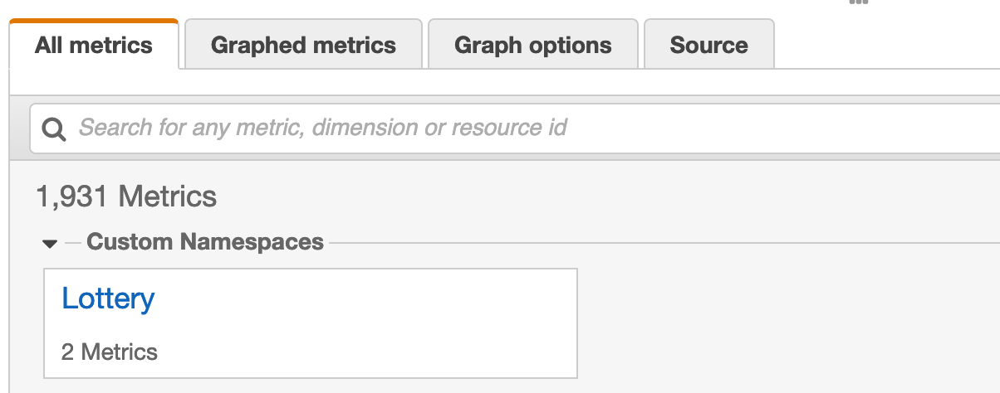

# metrics

You can use [Amazon CloudWatch Logs](https://docs.aws.amazon.com/AmazonCloudWatch/latest/logs/WhatIsCloudWatchLogs.html) to monitor, store, and access your log files from Amazon Elastic Compute Cloud (Amazon EC2) instances, AWS CloudTrail, Route 53, and other sources. [AWS Lambda](https://aws.amazon.com/lambda/) and [Amazon API Gateway](https://aws.amazon.com/api-gateway/) have very tight integration with Amazon CloudWatch Logs.

**Note** Your resource needs proper IAM permissions to create CloudWatch Logs Log Groups and Log Streams.


# Best practices

## Use structured logging

There are logging libraries that allow logs to be stored in a structured fashion. Tools like CloudWatch Logs Insights can automatically index the keys in a log message to make them query-able.

## Set a log retention period

CloudWatch Logs are retained indefinitely.  Please configure your rention period to match your business needs. Consider exporting data from CloudWatch Logs to more cost-effective solutions like [Amazon S3](https://aws.amazon.com/s3/) if your business requires long-term retention.

# Analyzing logs

You can use CloudWatch Logs Insights to interactively search and analyze your log data. You can perform queries to help you more efficiently and effectively respond to operational issues. CloudWatch Logs Insights includes a purpose-built query language with a few simple but powerful commands. Sample queries are included for several types of AWS service logs, including AWS Lambda.

## Sample queries

### p90 duration of a function

It can be helpful to understand the overall duration of a Lambda function by percentile.  A percentile indicates the relative standing of a value in a dataset.  For example, pct(@duration, 90) returns the @duration value at which 90 percent of the values of @duration are lower than this value, and 10 percent are higher than this value.

```bash
filter @type = "REPORT" | stats avg(@duration), max(@duration), percentile(@duration, 90) by bin(1m)
```
### Average max memory + p90 memory used

It can be useful to understand the amount of memory used during a function's execution.  The query below illustrates how to determine this information in 1min buckets.

```bash
filter @type = "REPORT" | stats avg(@maxMemoryUsed), percentile(@maxMemoryUsed, 90) by bin(1m)
```

### Function timeouts

It can be helpful to know when a function times out.  The query below illustrates the timeouts that occur in bins of 1 minute.

```bash
filter @message like "Task timed out after" | stats count() by bin(1min)
```

### Function cold starts

It can be helpful to know how often cold starts are occurring.  The query below illustrates how to capture function cold starts , warm starts, and associate data in bins of 1 minute.

```bash
filter @type = "REPORT" | parse @message /Init Duration: (?<init>\S+)/ | stats count() - count(init) as warmStarts, count(init) as coldStarts, median(init) as avgInitDuration, max(init) as maxInitDuration, avg(@maxMemoryUsed)/1024/1024 as avgMemoryUsed by bin(5min)
```

# Deploying sample application

A sample serverless application has been defined in (template.yml)[./template.yml].  This application is a Python function that returns a JSON payload of a lottery winner and the amount won.

The first step is to *build* the application including any dependencies.

```bash
sam build --use-container
```

Once the application has been bundled, it can be deployed by using the following command:

```bash
sam deploy --guided
```

# Examining custom metrics

Once the application has been deployed, it can be tested with an empty payload.  

```bash
export STACK_NAME=whatever_you_specified_during_guided_deploy
export FUNCTION=$(aws cloudformation describe-stack-resource --stack-name ${STACK_NAME} --logical-resource-id RandomWinnerFunction --query "StackResourceDetail.PhysicalResourceId" --output text)
aws lambda invoke \
    --function-name ${FUNCTION} \
    --payload '{ }' \
    response.json
```

The return value is stored in the file `response.json`.  This can be repeated any number of times to generate a function invocation.

The log group can be identified by running the following command.  Once identified, you can view the Log Streams in the AWS Console.  The Log Streams will contain the data emitted from the function handler `handler` in the file `index.py`.

```bash
aws logs describe-log-groups --log-group-name-prefix "/aws/lambda/${STACK_NAME}" --query "logGroups[*].logGroupName" --output text
```

Sample data:

```bash
{
    "LogGroup": "random-winner-RandomWinnerFunction-UME6DVT4CLAW",
    "ServiceName": "random-winner-RandomWinnerFunction-UME6DVT4CLAW",
    "ServiceType": "AWS::Lambda::Function",
    "service": "payout_service",
    "Player": "Adam",
    "RequestId": "80308025-291a-437a-92d7-c073d132dac3",
    "executionEnvironment": "AWS_Lambda_python3.6",
    "memorySize": "128",
    "functionVersion": "$LATEST",
    "logStreamId": "2020/04/21/[$LATEST]2054349ab30a4bb6b196d94f8c74c82c",
    "_aws": {
        "Timestamp": 1587458198751,
        "CloudWatchMetrics": [
            {
                "Dimensions": [
                    [
                        "LogGroup",
                        "ServiceName",
                        "ServiceType",
                        "service"
                    ]
                ],
                "Metrics": [
                    {
                        "Name": "PayoutAmount",
                        "Unit": "Sum"
                    }
                ],
                "Namespace": "Lottery"
            }
        ]
    },
    "PayoutAmount": 97
}
```

You can view the custom data in the CloudWatch Metrics panel under the namespace **Lottery**.



This is made possible through the use of EMF in `index.py`.  The metric and property values are emitted in the log and ingested as metrics.

```bash
...
...
    metrics.set_namespace('Lottery')
    metrics.put_dimensions({'service':'payout_service'})
    metrics.put_metric('PayoutAmount', random_number, 'Sum')
    metrics.set_property('Player', random_winner)
    metrics.set_property('RequestId', context.aws_request_id)
...
...
```